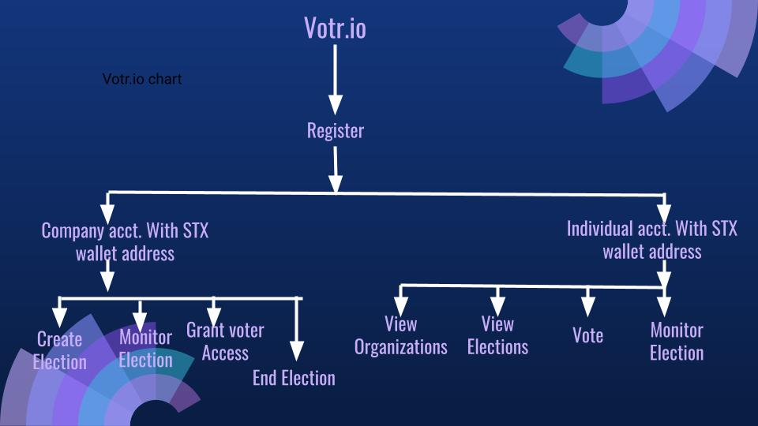
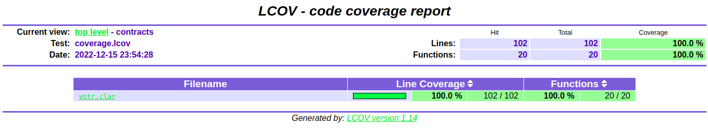

# **Votr.io**
### Votr.io is a voting DApp on the Stacks blockchain that allows companies to create elections and carry out voting exercises. 

## **DESCRIPTION**
Most times when elections are carried out, the voters are left in the dark concerning the progression of the exercise, and can only see the results when they are presented by the administrators of the exercise. Hence, credibility and transparency are not guaranteed, as the administrators can alter the results at any time without the knowledge of the voters. Votr.io is a Web3 voting platform that is designed with the aim allowing companies and other organizations like Co-operative societies to conduct internal election exercises smoothly over the stacks Blockchain. This platform guarantees transparency and credibility as the voters can monitor the progression of the voting exercise over the Blockchain. Furthermore, it is offering a cost effective and reliable means for organizations seeking to conduct election exercises.

## **TABLE OF CONTENT**
1. [Title](#Votr.io)
2. [Description](#description)
3. [Why **Votr.io**](#why-Votr.io)
4. [Features of Votr.io](#Features)
4. [Getting Started](#getting-started)
    - [Company Usage](#company-usage)
    - [Voters Usage](#voter-usage)
5. [Smart Contract Design](#smart-contract-design)
    - [Data Variables and Maps](#data-variables-and-maps)
    - [Functions](#functions)
6. [Testing](#testing)
7. [Special Thanks](#special-thanks)

## Why _**Votr.io**_ 
The design of Votr.io.io is tailored towards fixing the long-standing issue of transparency and credibility of elections. With this DApp, election administrators would not have to answer the question of fairness and the validity of votes cast. Over the years, voting exercise carried out on TV shows like Big Brother Nija and even the Balon D’or player of the year award where a particular contestant is expected to win the competition or award due to their performance and the large fan support they have, but ends up not wining when the final results are released. This causes a lot of controversy and makes the voters and entire fan base question the integrity of the results. However, with Votr.io.io this problem is solved as the entire exercise is open and can be monitored by the voters and any person that would be interested in the progression of the exercise but yet cannot be altered not even by the administrators of the exercise.  
In the continent of Africa where the conventional means of election is used, a considerable number of votes are always rejected as invalid, due to errors from voters. However, with this method which is a blend of internet voting and the block chain technology, there is no room for voting error from voters, as it is done digitally (on the stacks block chain).
Furthermore, it is very expensive to organize conventional elections, especially elections for political positons. This is very much evident in our home country Nigeria where the previous National election cost over NGN242biliion which is about $543million to organize and conduct. This is very expensive considering the fact that Nigeria is still a developing country. However, Votr.io.io presents a cheaper and effective means for countries to conduct elections.
Moreover, in the African continent, when elections are being conducted economic activities are halted all through the day of the election due to security reasons; this ultimately cost the country a lot even more than the actual cost of conducting the elections. Votr.io.io is a lasting solution to this problem as people can vote using their smartphones or computers from the comfort of their homes, offices, and business locations.

## **Features**


Equipped with the following features, Votr.io.io effectively dispenses its function to our users;
### **Register**
The register feature allows organizations signup with the platform using their stacks wallet address. Thus, giving the permission to create their company profile and election exercises.

### **Create Election**
This feature allows all registered organizations to create an election exercise tailored to their specific need. They are able to input the title of the election, the details of the contestants, the number of expected voters and finally post the election for credible voters to cast their votes.
### **View Elections**
The view election feature enables registered organizations and voters to view the number of current elections that are posted by an organization. This returns the election titles, time of creation, and the time left before expiration of each of the 
posted elections.
### **Authorize Voters**
This feature requires the hosting organization to send NFTs to the intended voters. The election will start only when the organization sends out the authorization NFTs to the voters.
### **Start**
The start feature allows organizations to kick start the posted election exercise.
### **Vote**
Users who have been registered to the platform are permitted to take part in any election of their choice so long as they are eligible for the particular election of their interest, and with the availability of the cast vote function, they can successfully vote for their preferred contestant. 
### **Check Election**
With this feature, voters and organizations alike are given the privilege to follow and monitor any election exercise of their choice. Which gives room for credibility, transparency, and accountability of the exercise; as voters are no longer kept in the dark regarding the events of the election exercise. 
### **End Election**
The end election feature gives the organization the privilege to end an election after they are certain the exercise is completed. However, the organization cannot end the election until the stipulated time of the election expires; this restricts the organization from tampering with the exercise and ultimately increases the credibility of the exercise. On expiration of the stipulated time, the organization is required to end the election by clicking the “end election” button but if they are unable to do so, an admin of the platform can do it for the in order to save up space on the block chain. Although admins of the platform can step in to end elections when the time of the exercise is elapsed, they can only do so when and only when the time elapses, and cannot do so at any random time just like the host organization.

## **Getting Started** 
In order to access the platform, voters and companies alike need to log on to Votr.io.io and sign up using their stacks wallet address. From there on, the usage of the platform for companies differs from that of voters.
### **Company Usage** 
Companies are the election creators and as a result when they get registered, they receive a dashboard through which they can create election exercises using the Create Election button. When creating and election, they will be asked to provide the following data; election title, contestant details, election duration, number of accredited voters. The field for number of accredited voters is essential as the Votr.io.io platform will generate NFTs that would give voters access to cast votes in that election. Thus, holders of the election specific NFT are the only credible participants in the exercise.  After these fields are successfully inputted, the organization can then post the election, signaling the commencement of the exercise.
card_file_box options-ledger-list
### **Voter Usage** 
After successfully signing up with the platform, voters can use the search bar to find organizations on the platform and see the elections they have posted. Afterwards, they can select any election they have access to and vote their desired contestant.

## **Smart Contract Design** 
This DApp is comprised of only one smart contract. The Vot` contract which contains all needed algorithm to provide transparent and credible election for organizations and the NFT that will be issued to voters, which grants them a valid access to the election.
### **Data Variables and Maps** 
    •   RegisteredOrganizations
        The RegisteredOrganizations maps; 
        the name of the organization to their wallet address
    •   The Elections map holds all the data necessary to describe an election that has been  created. It maps election-id against:
        ◦ the title of the election
        ◦ the total-voters 
        ◦ the expiration of the election
        ◦ the invitation-sent 
        ◦ the status of the election which will be "Inactive" till the election has started
        ◦ the contestants of the election
        ◦ the creator name of the organization that created the election
    •   The ContestantVotes map holds information about the contestants of the election. It maps the election-id and their wallet 
        address against:
        ◦ the votes - the number of votes each contestant got
        ◦ the name of the contestants
    •   The Voters map maps the address of a voter and the election-id against:
        the supporter - the contestant they voted for
    •   The elections-id variable represents the unique id for every election created by incrementing whenever an election is 
        created
    •   The registration-fee variable holds how many STX an organization will pay for registration. It's a variable because the   
        Votr.io-admin only will have the right to change it
    •   The total-registered-organizations variable keeps a count for the number of registered organizations
    •   The Votr.io-admin variable is a wallet address that has the permission to register an organization, end an election, change 
        the registration fee and also set a new admin.
### **Functions** 
    • get-last-token-id
  		This is a read-only function that returns the id of the last minted NFT
    • get-token-uri
  		This is a read-only function that returns the uri of a particular token, but in our contract returns none, because we don't have uri yet
    • get-owner
  		This function returns the owner of the NFT with id passed in
    • transfer
 		 This is a public function that transfer NFT from one address to another. It gives voters the ability to vote with a different stx account
    • register
  		This is a public function that gives organizations the right to call other functions. It takes in organization-name and address as arguments and then set it to the ‘RegisteredOrganizations’ map. Then organizations pay a fee of 100STX - registration fee
    • create-election
  		This function takes in the organization-name, title of elections, total-voters and contestants of the elections as a list of tuples. It sets the ‘Election’ map and the ‘ContestantVotes’ map with the help of a private function. The election will be created but have a status of "Inactive" and will be given an id that is unique to that election.
    • authorize-voters
 		 This function is callable by only registered organizations that has created an election. It is used to issue out NFT to addresses that will be voting for the election.
    • start-election
  		This function sets the status of an election to "Active" so that voters can start voting for their desired contestant and it also set the expiration of the election.
    • Vote
        This function takes in the election-id, contestant and the id of the NFT issued to the voter as arguments. It increments the number of votes for the contestant passed in and burns the NFT used to vote.
    • end-election
  		This function deletes the Election map from our contract
    • get-election-info
  		This is a read-only function that returns the details of an election. It takes in the election-id as an argument.
    • get-contestants-info
 		 This function returns information for every contestant present in an election
### **Helper Functions**
    • send-invitation
        This is a private function that does the minting of the nft that will be used for the authorization of voters.
    • send-invitation-to-many
        This function makes use of the send-invitation function. It runs the send-invitation function for all the principals in the list passed in as arguments.
    • burn-invitation
        This takes care of burning nfts of voters after their votes have been casted.
    The three functions above are private functions, because, we only want organizations/companies to call them indirectly.
    
    • init-contestant
        This function sets all the contestants of an election to the ContestantVotes map
    • contestant-to-election
        This function merges the election-id of contestant to the tuple value in the ContestantVotes map. This is used to differentiate contestant in their various elections.
    • fetch-contestant-votes
        This function get the value of the ContestantVotes map. It is private function because it will be used in another function to get the value of the ContestantVotes map for all contestants.
    • can-send-invitation
        This function does a check. It checks if all the voters of an election have been sent their nfts that authorizes them to vote.
    • get-address
        This function gets the address from a tuple that will be passed in as an argument to any function. It gets the address from the tuple.
## **Testing** 

The repo contains a comprehensive testing suite for Votr.io contract. As the above coverage report shows, we have tests for 100% of the functions in our contracts as well as 100%+ of lines of code.

Any suggestions and ideas on how we can improve the testing suite are highly encouraged. As a next step we intend to have the contracts audited.

To produce the lcov report, use the following commands

```
$ clarinet test --coverage
Then use the lcov tooling suite to produce HTML reports:
$ brew install lcov
$ genhtml coverage.lcov
$ open index.html
```
### **Special Thanks** 
We would like to thank the Incrypro Encrypted clan for their immense support and advice, and also for encouraging and leading us to explore web3 and Blockchain development.
We would also like to thank Mr. Angaye Seimokumo our programming instructor for also inspiring and pushing us to explore our skills in developing problem solving ideas.
Finally, we are appreciating the organizers of Clarity Camp and the administrators of the clarity holiday hackathon for giving us the opportunity to test our abilities and showcase our skills in developing on the web3 space using clarity.
